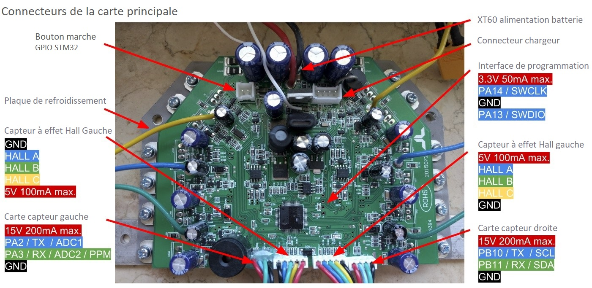
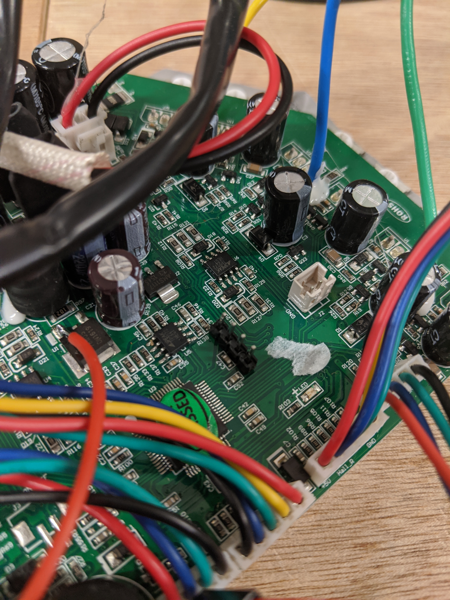

*Design graphique : [Arnaud ROI](mailto:arnaudroi@gmail.com)*
## Matériel nécessaire
* Un hoverboard fonctionnel
* Une clé usb [ST-Link V2](https://www.amazon.fr/gp/product/B07H9XV2W2/ref=ppx_yo_dt_b_asin_title_o07_s00?ie=UTF8&psc=1)
* Tournevis
* Fer à souder
* Connecteurs mâle de PCB
* Fils de connexion
* Multimètre
* Adapteur USB-série (facultatif mais utile pour calibration ADC)

## Etapes
1. Démonter l'hoverboard
2. Démonter la carte mère du refroidisseur. Dévisser les vis cruciformes.  
3. Souder 4 connecteurs de PCB mâle à l’emplacement « Interface de programmation » dans l’image ci-dessous    
4. Remonter la carte mère sur refroidisseur  
5. Récupérer les sources [ici](hoverboard-firmware-hack.zip)
6. Compiler les sources   
6.1 [Mettre en place l'environnement sous Windows 10](environnement.md)  
6.2 [Compilation](compilation.md)
7. Installer l'[utilitaire de flashage](st_link_utility.md)  
7.1 [Flasher le fichier précédemment compilé sur la carte principale](flashage.md)  
  
_____  
# Bonus  
Le Nunchuck de Nintendo peut être alimenté en 5V continu.  
Pour récupérer du 5V sur la carte, souder un fil sur la patte gauche du régulateur de tension.    
Fil rouge sur la photo ci-dessous.  
  

Ce projet a été possible grâce au travail notamment de [NiklasFauth](https://github.com/NiklasFauth/hoverboard-firmware-hack) et le forum [cyclurba](https://cyclurba.fr/velo/897/hoverboard-tutoriel-modification-firmware.html)
  
 Cette œuvre est mise à disposition selon les termes de la <a rel="license" href="http://creativecommons.org/licenses/by-sa/4.0/">Licence Creative Commons Attribution -  Partage dans les Mêmes Conditions 4.0 International</a>.
