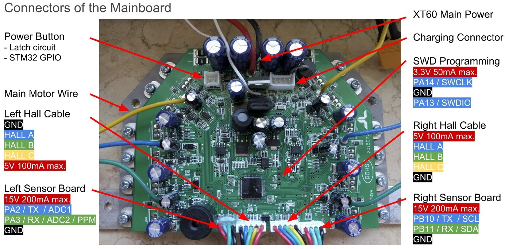

## Matériel nécessaire
* Un hoverboard fonctionnel
* Une clé usb [ST-Link V2](https://www.amazon.fr/gp/product/B07H9XV2W2/ref=ppx_yo_dt_b_asin_title_o07_s00?ie=UTF8&psc=1)
* Tournevis
* Fer à souder
* Connecteurs mâle de PCB
* Fils de connexion
* Multimètre
* Adapteur USB-série (facultatif mais utile pour calibration ADC)

## Etapes
1. Démonter l'hoverboard
2. Démonter la carte mère du refroidisseur
3. Souder 4 connecteurs de PCB mâle à l’emplacement « SWD Programming » dans l’image ci-dessous    
4. Remonter la carte mère sur refroidisseur  
5. Récupérer les sources [ici](/hoverboard-firmware-hack)
