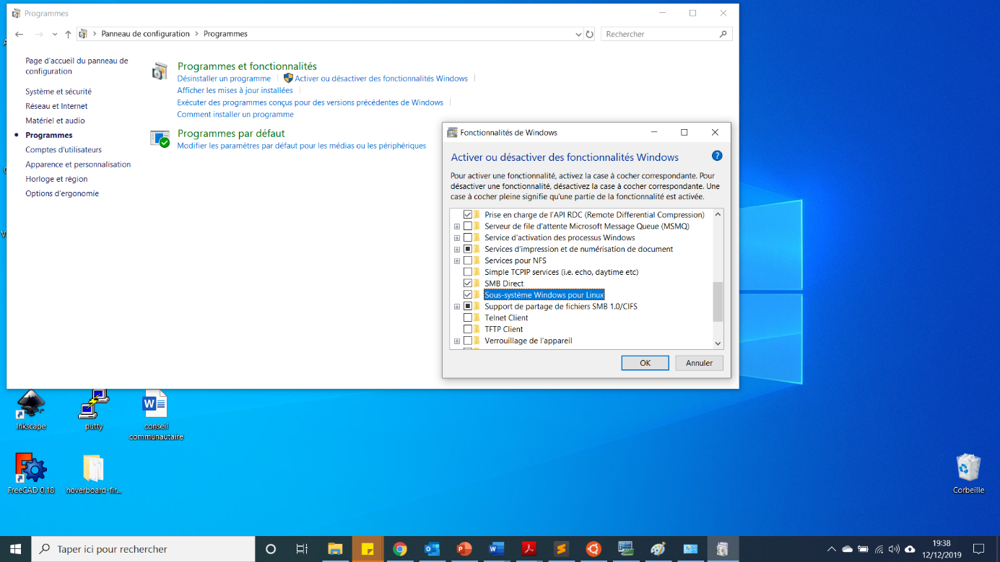
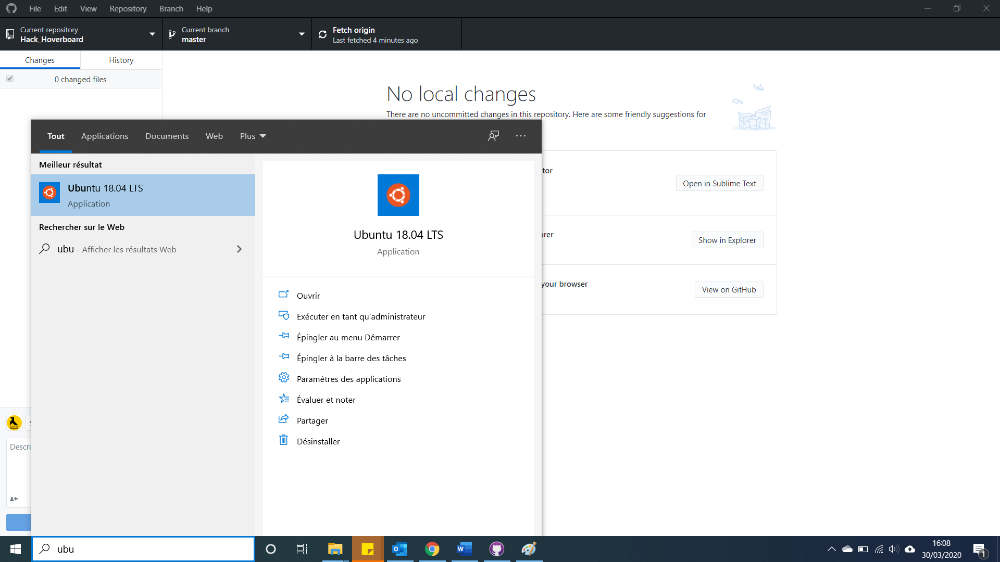

# Environnement de compilation
  
## Installer Linux sous Windows 10  
1. Aller dans Panneau de configuration  
2. Programmes  
3. Activer ou désactiver des fonctionnalités Windows   
4. Cocher Sous-système Windows pour Linux   
5. Cliquer sur OK
6. Redémarrer l'ordinateur
7. Quand l'ordinateur a redémarré, aller dans Microsoft Store et taper Linux dans la barre de recherche  
8. Installer la distribution de votre choix (nous recommandons Ubuntu 18.04 LTS)  
9. Pour lancer la distribution installée, ouvrir le menu démarrer et la rechercher    

## Installer l'environnement de développement Linux
1. Taper les commandes suivantes pour installer la chaine de compilation :
```console
fablab@DESKTOP-73ELB6A:~$ sudo add-apt-repository ppa:team-gcc-arm-embedded/ppa
fablab@DESKTOP-73ELB6A:~$ sudo apt update  
fablab@DESKTOP-73ELB6A:~$ sudo apt install gcc-arm-embedded build-essential
```  

___

# Fin de l'installation de l'environnement de compilation

