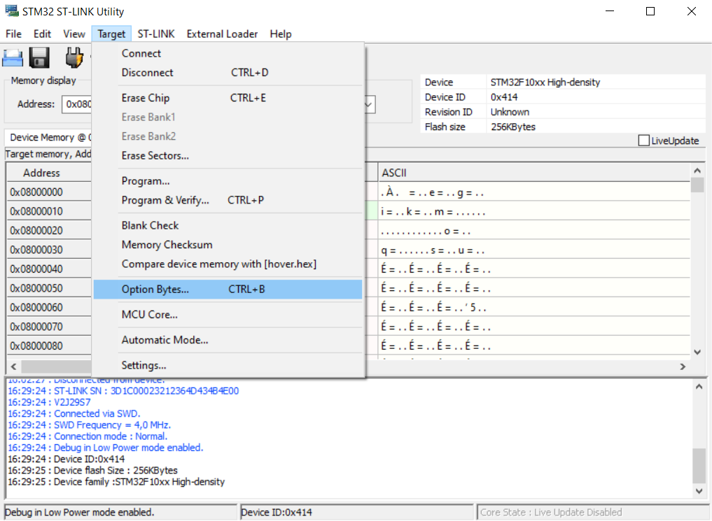
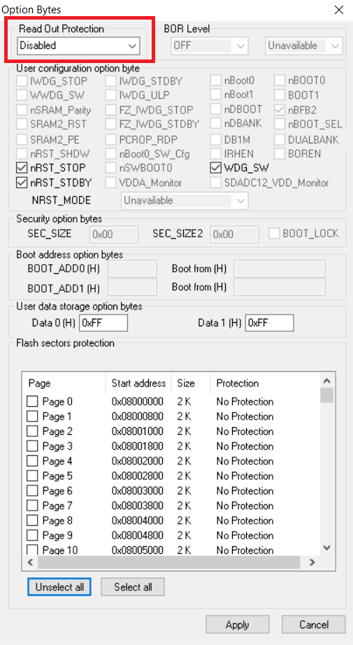
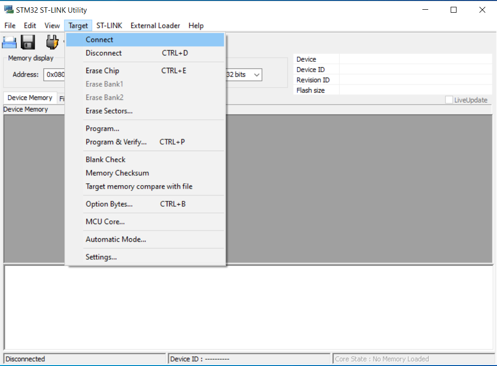
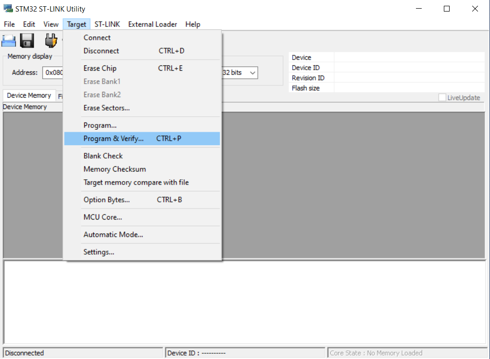
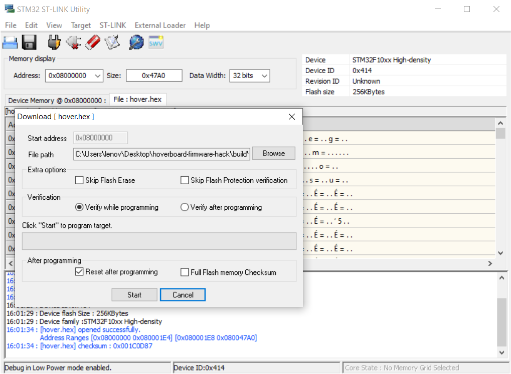

# Connexion  
Pour pouvoir flasher (action de télécharger un programme dans la mémoire d'un microcontrôleur) il faut connecter la carte principale de l'hoverboard sur le PC grâce à la clé ST-Link.   
Nous aurons besoin de 3 fils avec des connecteurs femelles des deux côtés de chaque fil.  
Nous utiliserons les broches :  
* SWDIO  => fil bleu  
* GND    => fil noir  
* SWCLK  => fil jaune  

Les connexions à réaliser du côté de la carte principale sont visibles sur la photo ci-dessous.  
**Attention, ne rien connecter sur la première broche**    

 

Pour être flashée, la carte principale a besoin d'être alimentée.  
Nous utiliserons, pour cela, la batterie de l'hoverboard.  
**Elle doit être suffisamment chargée !**  

# Etapes
1. Connecter le ST-Link en suivant les indications ci-dessus  
2. Brancher la batterie à l'aide du connecteur XT60  
    

3. Lancer le logiciel *STM32 ST-LINK Utility* précédemment installé        
4. Appuyer sur le bouton "Marche" de l'hoverboard et **NE PAS LE RELACHER** avant la fin de l'étape de flash  
   

5. Brancher la clé ST-Link sur un port USB de l'ordinateur. Si c’est la première fois que vous branchez votre ST-LinkV2 il faut attendre un peu pour qu’il soit reconnu par Windows         
6. Si c'est la 1ère fois que vous flashez votre carte, il faudra désactiver la protection. Si vous ne faites pas cette étape, vous aurez un message d'erreur        
6.1 Pour cela il faut ouvrir le menu Target, puis Options Bytes et mettre Read Out Protection sur Disable puis cliquez sur Apply  
     
  

7. Maintenant que la protection est enlevée, nous pouvons nous connecter sur la carte en cliquant sur *Target* puis *Connect*  
  

8. Nous pouvons à présent choisir le nouveau firmware à transférer dans la mémoire du micro contrôleur en cliquant sur *Target* puis *Program and Verify*  
  

9. La fenêtre suivante doit s'ouvrir  
  

10. Cliquez sur *Browse*, choisir le fichier hover.hex précédemment compilé, puis cliquez sur *Start*. S'assurer que la case *Verify while programming* est bien cochée ainsi que *Reset after programming*  
11. Lorsque le flashage est terminé et si tout s'est bien passé, vous devriez entendre une petite mélodie sur le buzzer de la carte principale de l'hoverboard  
12. Vous pouvez alors cliquer sur *Target* puis *Disconnect*, débrancher la clé ST-Link et débrancher la batterie  

___

# Félicitation ! Vous venez de flasher votre propre firmware

